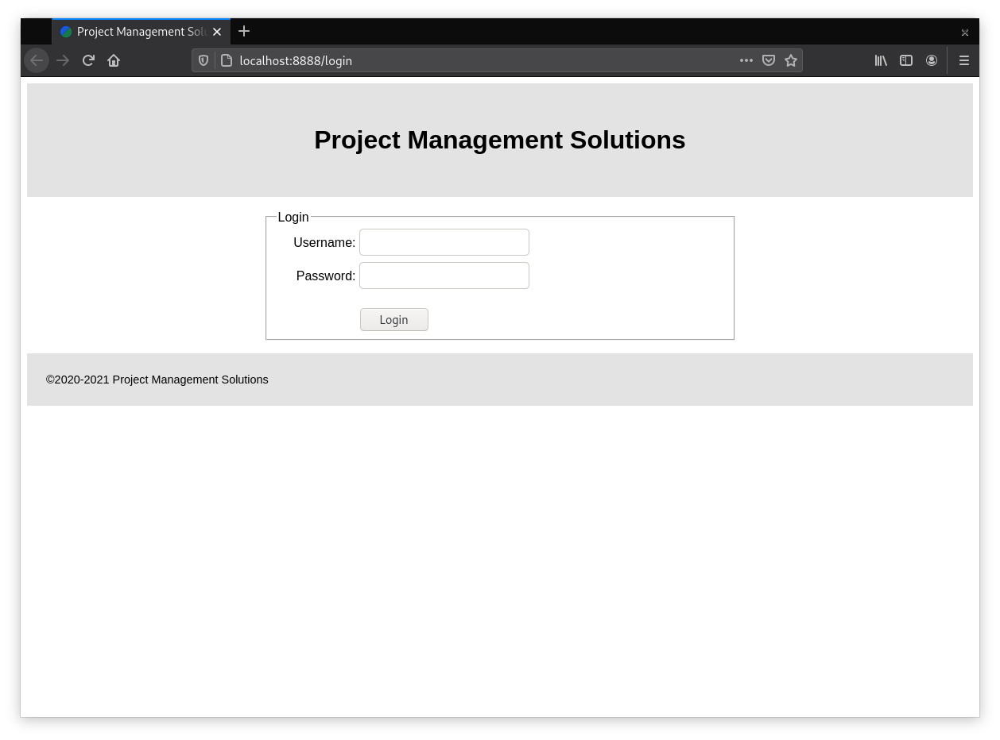
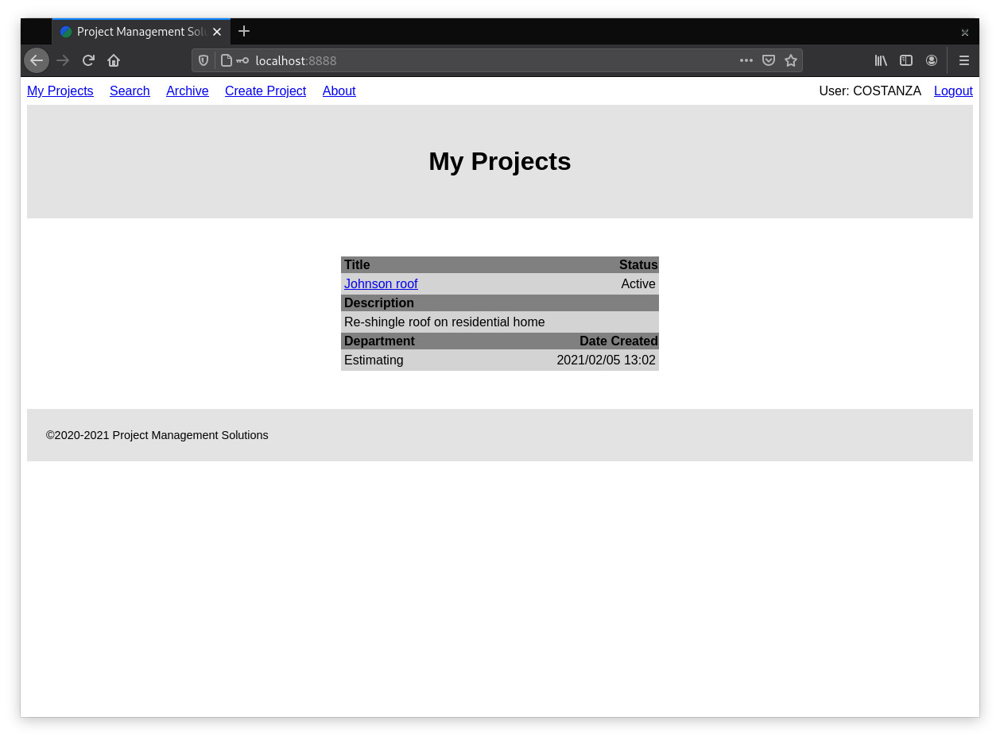
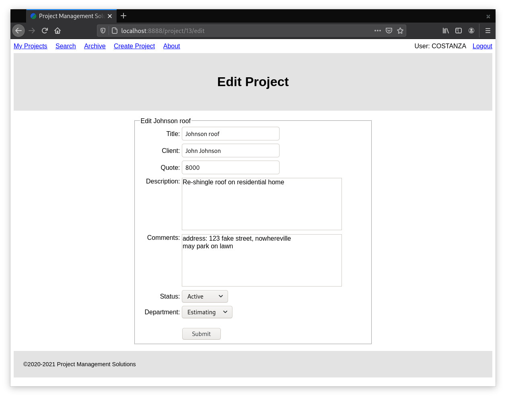

# PHP Project Management Application

This project is a project management application that utilizes PHP in combination with a MySQL database to allow for users to create and modify projects and the tasks associated with them.  Authentication and authorization are supported via a salted password hash for each user of the system along with session variables to track the currently signed in user per browser session.

## Getting Started

These instructions will get you a copy of the project up and running on your local machine for development and testing purposes.

### Prerequisites

```
PHP 7.4 Copyright (c) The PHP Group
MariaDB Distrib 10.4.17
```

### Installing

You will need to have PHP installed as well as MySQL Server (or MariaDB).

Enter the following line into your command terminal to see which version of php you have installed. If not, please see installation instruction at [php.net](https://www.php.net/).

```
php --version
```

Enter the following line into your command terminal to see which version of MariaDB you have installed. If not, please see installation instruction at [mariadb.org](https://mariadb.org/).

```
MariaDB --version
```






## Built With

* [VSCode](https://code.visualstudio.com/) - Development environment
* [Git](https://git-scm.com/) - Version Control System

## Authors

* **N.T. Carruthers**  - [GitHub](https://github.com/gif007)

## License

This project is licensed under the MIT License - see the [LICENSE.md](LICENSE.md) file for details

## Acknowledgments

* See [Laracasts.com](https://laracasts.com/series/php-for-beginners) for the tutorial on which the underlying MVC framework was built