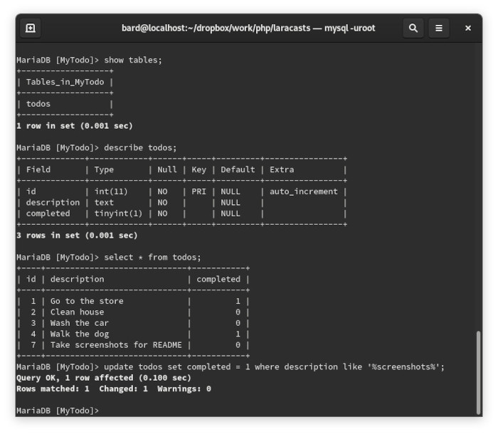
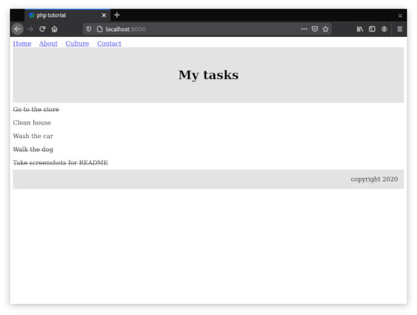

# PHP Framework

This project contains a MVC web application framework built up from scratch using PHP and MariaDB. It is an ongoing project based on the Laracasts tutorial series by Jeffrey Way which can be found [here](https://laracasts.com/series/php-for-beginners). The purpose of this project is to familiarize myself with the most common PHP methods and how to apply them to the MVC design pattern.

## Getting Started

These instructions will get you a copy of the project up and running on your local machine for development and testing purposes.

### Prerequisites

```
PHP 7.3.21, Copyright (c) 1998-2018 Zend Technologies
MariaDB 10.3.22, Copyright @ 2009 - 2020 MariaDB Foundation
```

### Installing

The following installation instructions are for Fedora Workstation. For other operating systems please see Google.

Install PHP

```
dnf install php
```

Install MariaDB

```
dnf install mariadb
```

Notes: MySQL should work as a stand-in for MariaDB as the latter is a fork of the former




Development server was run using:
```
php -S localhost:8000
```


## Built With

* [MariaDB](https://mariadb.org/) - Relational database
* [Sublime-Text](http://www.sublimetext.com/docs/3/) - Development environment
* [Git](https://git-scm.com/) - Version control system

## Authors

* **N.T. Carruthers** - [GitHub](https://github.com/gif007)

See also the list of acknowledgements.

## License

This project is licensed under the MIT License - see the [LICENSE.md](LICENSE.md) file for details

## Acknowledgments

* Hat tip to Jeffrey Way for the great PHP tutorial series on his [website](https://laracasts.com/) on which this project was based